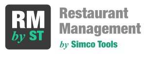
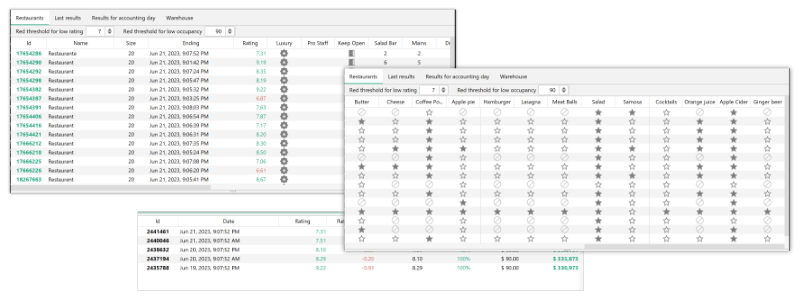
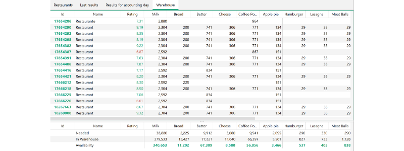

**Go to the [last release page](https://github.com/ricardoantonio/RestaurantManagement/releases/latest) to download the latest release.**

---

**Restaurant Management by Simco Tools** is an application designed to simplify the management and review of restaurants in the game [Sim Companies](https://www.simcomapnies.com). This tool provides a convenient way to monitor and analyze the state and statistics of your in-game restaurants.

## Features

1. **Restaurant Overview:** Get an overview of all your restaurants in one place. View key information such as restaurant name, type of building, rating, and menu. Select a restaurant to see their historical runs.

2. **Last Cycle Result:** View the financial result and the impact of the rating for each of your restaurants in the last cycle. Identify the profit or loss generated during the previous game cycle and understand how the rating affected your restaurant's performance.

3. **Review of Results by Accounting Day:** Analyze the financial results of your restaurants on a daily basis. Track profits and rating performance for each accounting day to identify trends and patterns.

4. **Inventory Status:** Monitor the inventory status of your restaurants. View the list of resources required for the upcoming cycle and check the status of your inventory. Keep track of stock levels to ensure efficient management and avoid shortages.

## Getting Started:

1. Go to the last release page here.

2. Download the application file for your respective operating system (Windows or Mac).

Now you can proceed with using the Restaurant Management by Simco Tools application.

**Enjoy _managing your restaurants with Simco Tools_ on your Windows or Mac system!**

## Disclaimer: No Liability Assumed

The Restaurant Management by Simco Tools application is provided as is, without any warranties, expressed or implied. We do not assume any responsibility for any damages, losses, or inconveniences caused by the use of this application. The use of the application is at your own risk and discretion. We reserve the right to modify, update, or discontinue the application at any time without prior notice. By using this application, you acknowledge and understand this disclaimer and release the developers and contributors from any liability associated with the use of the application. Always use the application responsibly and in accordance with the rules and regulations of the Sim Companies game.

## Contact:

For any questions, inquiries, or to report issues, please contact our support team at **support@simcotools.app.** You can also open an issue on our GitHub repository for problem reporting and suggestions.
